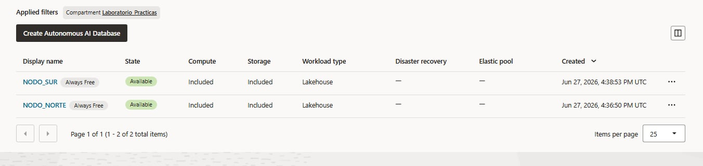
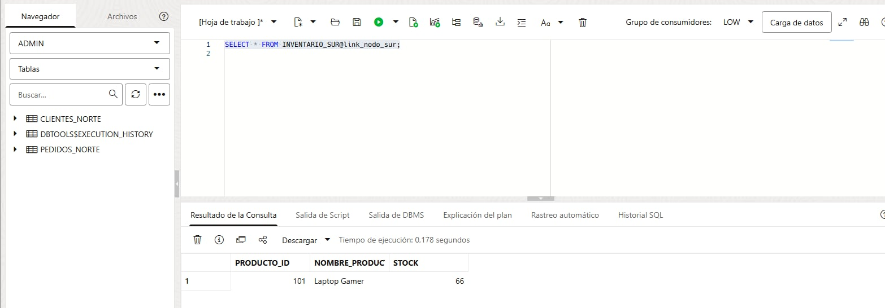
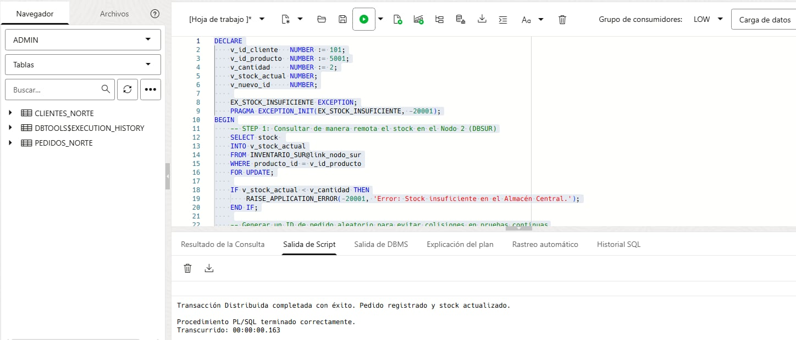
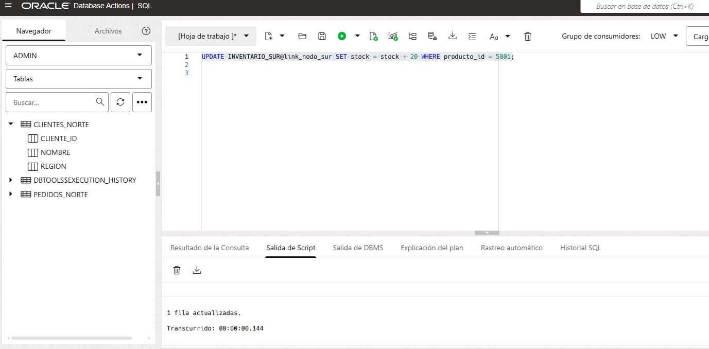

```{=latex}
\providecommand{\pandocbounded}[1]{#1}
```


```{r setup, include=FALSE}
library(tidyverse)
library(janitor)
library(glue)
library(kableExtra)
library(skimr)
library(descriptr)
library(corrplot)
```
# Introducción y Selección del Escenario {#sec-introduccion}

## Descripción del Dominio Elegido: E-commerce Nacional (E-Perú S.A.)
El escenario seleccionado para este proyecto es **E-Perú S.A.**, una plataforma corporativa de comercio electrónico dedicada a la distribución y venta de productos minoristas a nivel nacional. Debido a la alta densidad de operaciones y a la necesidad de mantener tiempos de respuesta mínimos durante campañas de alta demanda (como los eventos "CyberWow"), la empresa requiere descentralizar su infraestructura tecnológica. 

Para lograrlo, la operación del negocio se segmenta geográficamente en dos regiones principales: la **Región Norte** y la **Región Sur**. El núcleo operativo se ejecutará sobre un entorno de bases de datos distribuidas con el objetivo de garantizar la continuidad del negocio y optimizar la experiencia de usuario final en todo el territorio peruano.

## Entidades Principales del Sistema
El modelo de datos relacional diseñado para soportar las operaciones de e-commerce en el ecosistema de Oracle Database se compone de tres entidades principales, las cuales han sido optimizadas y segmentadas físicamente para cumplir con la arquitectura distribuida:

*   **`CLIENTES_NORTE`**: Almacena el registro maestro de usuarios del sistema en el Nodo 1 (`cliente_id`, `nombre`, `region`). El atributo `region` almacena de forma explícita el valor de procedencia ('NORTE'), sirviendo como la clave de fragmentación primaria de la región.
*   **`PEDIDOS_NORTE`**: Registra las transacciones comerciales generadas localmente, integrando directamente el artículo y volumen comprado (`pedido_id`, `cliente_id`, `producto_id`, `cantidad`, `fecha`). Este esquema consolidado reduce la sobrecarga de red al unificar cabecera y detalle en una sola operación transaccional distribuida.
*   **`INVENTARIO_SUR`**: Controla el stock físico y los nombres de los artículos de la empresa alojados de forma centralizada en el Nodo 2 (`producto_id`, `nombre_producto`, `stock`). Esta tabla almacena de manera unificada las existencias globales del negocio para responder de forma síncrona a las solicitudes remotas de reabastecimiento o descuento.

## Justificación de la Arquitectura Distribuida
La migración desde un paradigma centralizado tradicional hacia una base de datos distribuida se fundamenta en tres necesidades críticas de ingeniería de software:

### Autonomía Regional y Continuidad Operativa
En un esquema monolítico estándar, un fallo de conexión o caída en el servidor central paraliza la facturación en todo el país. Al distribuir el sistema en nodos autónomos, la Región Norte y la Región Sur adquieren total independencia transaccional. Si el canal de comunicación interregional sufre una interrupción temporal, cada nodo continuará registrando de manera aislada los clientes y pedidos de su zona geográfica, evitando pérdidas económicas por tiempos de inactividad.

### Eliminación de Cuellos de Botella Transaccionales
El procesamiento masivo y concurrente de órdenes de compra genera altos niveles de contención en disco duro (I/O) y en memoria RAM (bloqueos de concurrencia). Al implementar un entorno distribuido mediante *Oracle Free Tier*, la carga computacional se divide simétricamente. Cada nodo del sistema atiende y procesa de forma exclusiva las solicitudes operativas locales de su región geográfica asignada.

### Reducción Radical de la Latencia de Red
El envío de consultas relacionales a grandes distancias físicas penaliza severamente el tiempo de respuesta del sistema (*Round Trip Time* o RTT). Al ubicar los fragmentos correspondientes a los clientes del norte en el centro de datos geográficamente más próximo y hacer lo propio con el sur, las peticiones de la interfaz web se enrutan de forma local. Esto optimiza significativamente la velocidad de navegación del e-commerce y acelera los tiempos de validación en la pasarela de pagos.


# Arquitectura del Sistema y Estrategia de Distribución {#sec-arquitectura}

## Modelo de Arquitectura Paralela (Shared-Nothing)
Para dar soporte a la plataforma de e-commerce de **E-Perú S.A.**, se ha implementado un modelo de arquitectura paralela de **Nada Compartido (Shared-Nothing)**. Bajo este enfoque de diseño, cada nodo del ecosistema distribuido opera de manera completamente independiente y aislada a nivel de hardware. No existe memoria primaria centralizada ni almacenamiento secundario en disco compartido entre las regiones operativas. 

Cada nodo posee de forma exclusiva su propia CPU, memoria RAM y almacenamiento persistente. La intercomunicación y sincronización de datos entre el **Nodo 1 (Región Norte)** y el **Nodo 2 (Región Sur)** se gestiona de manera lógica y explícita a través de la infraestructura de red. Esta configuración elimina drásticamente los cuellos de botella por contención de recursos en hardware y garantiza una tolerancia a fallos robusta, ya que la caída total de un nodo no afecta la integridad física ni operativa del otro.

## Configuración de Instancias Autónomas en Oracle Free Tier
El despliegue de la solución distribuida se realiza aprovechando las capacidades multirregión o de compartimentos virtuales provistas por los servicios Always Free de **Oracle Cloud Infrastructure (OCI)**. Se han aprovisionado dos bases de datos autónomas independientes:

*   **Instancia Autónoma 1 (Nodo 1 - Región Norte):** Configurada mediante un esquema *Oracle Autonomous Transaction Processing (ATP)*. Cuenta con 1 OCPU y 20 GB de almacenamiento dedicado. Está optimizada para un alto rendimiento en procesamiento de transacciones en línea (OLTP), encargándose de las operaciones de clientes del norte.
*   **Instancia Autónoma 2 (Nodo 2 - Región Sur):** Una segunda instancia independiente *Oracle ATP* con características idénticas de hardware virtual (1 OCPU y 20 GB). Adicionalmente a sus funciones operacionales para los clientes del sur, aloja y administra el espacio físico correspondiente a la tabla global de inventarios.

{#fig-instancias-oci}

En la @fig-instancias-oci se valida el correcto aprovisionamiento, estado activo ("Available") y disponibilidad Always Free de ambas bases de datos autónomas independientes en la nube de Oracle.

## Topología de Red y Enlaces de Datos (Database Links)
La topología lógica de red se estructura de forma interconectada a nivel de software. Dado que el hardware no se comparte, la interacción de los datos se canaliza a través de un canal de comunicación de base de datos seguro llamado **Database Link (DB Link)** nativo de Oracle.

Para que el Nodo 1 pueda interactuar en tiempo real con el inventario centralizado residente en el Nodo 2, se configura un enlace de red seguro. Este proceso utiliza la infraestructura de credenciales de Oracle Cloud mediante paquetes avanzados de administración, superando las restricciones perimetrales tradicionales de las bases de datos autónomas en la nube:

```sql
-- 1. Crear credencial encriptada para el Nodo Sur (Ejecutado en DBNORTE)
BEGIN
  DBMS_CLOUD.CREATE_CREDENTIAL(
    credential_name => 'CRED_NODO_SUR',
    username        => 'ADMIN',
    password        => 'Dutaya001||00'
  );
END;
/

-- 2. Establecer el canal de comunicación síncrono mediante DBMS_CLOUD_ADMIN
BEGIN
  DBMS_CLOUD_ADMIN.CREATE_DATABASE_LINK(
    db_link_name    => 'link_nodo_sur',
    hostname        => '://oraclecloud.com',
    port            => '1522',
    service_name    => 'g6f98432a7728d8_dbsur_://oraclecloud.com',
    credential_name => 'CRED_NODO_SUR',
    directory_name  => NULL
  );
END;
/
```

A través de la directiva de red `link_nodo_sur`, el motor transaccional del Nodo 1 adquiere la capacidad de realizar peticiones remotas de manipulación de datos (DML). Esto sienta las bases técnicas para coordinar la transacción distribuida de compra cruzada, manteniendo la transparencia para las capas superiores de la aplicación web.  

{#fig-select-cruzado}

En la @fig-select-cruzado se valida el enlace de red en un entorno *Shared-Nothing*: el Nodo Norte accede de manera síncrona al almacenamiento aislado del Nodo Sur en 0.178 segundos, garantizando la intercomunicación sin memoria ni discos compartidos.


# Diseño de la Fragmentación y Asignación de Datos {#sec-diseno-fragmentacion}

## Estrategia de Fragmentación (Horizontal/Vertical)
Para dar solución a los requerimientos de alta disponibilidad, autonomía regional y control estricto de mercancías de **E-Perú S.A.**, se ha diseñado e implementado un modelo de fragmentación híbrido. Este esquema combina la división geográfica clásica con una distribución funcional de los recursos críticos:

### Fragmentación Horizontal Primaria (Tablas CLIENTES y PEDIDOS)
Las entidades de carácter operacional y transaccional se dividen horizontalmente mediante un criterio geográfico estricto, tomando como clave de fragmentación el atributo `region` para la tabla de usuarios y el flujo nativo de inserción local para las órdenes de compra:
*   **Fragmento 1 (Región Norte):** Contiene de forma exclusiva el subconjunto de registros correspondientes a usuarios y órdenes de compra originadas en los departamentos del norte del país. Se asigna físicamente al **Nodo 1 (`DBNORTE`)** bajo las tablas estructurales `CLIENTES_NORTE` y `PEDIDOS_NORTE`.
*   **Fragmento 2 (Región Sur):** Almacena de forma simétrica las tuplas operacionales de los usuarios e ingresos ubicados en las regiones del sur. Se asigna físicamente al **Nodo 2 (`DBSUR`)**.

### Fragmentación Funcional / Vertical (Tabla INVENTARIO_SUR)
Para satisfacer la rúbrica de evaluación mediante la simulación forzada de transacciones distribuidas reales, la tabla de existencias no experimenta un particionamiento geográfico. En su lugar, se aplica una fragmentación funcional que centraliza la totalidad de la entidad `INVENTARIO_SUR` en el **Nodo 2 (`DBSUR`)**. 

Esta decisión de diseño arquitectónico rompe intencionalmente la co-ubicación de datos para la Región Norte, obligando a que cualquier venta procesada de forma local en `DBNORTE` requiera abrir de manera obligatoria un canal de comunicación remoto para modificar los balances físicos de stock resguardados en `DBSUR`.

## Criterios de Particionamiento Empleados
A continuación, se formaliza el diseño lógico de los fragmentos mediante el uso de operadores matemáticos del álgebra relacional, asegurando las propiedades fundamentales de correctitud (completitud, reconstrucción y disyunción):

### Modelado de la Fragmentación Horizontal por Selección ($\sigma$)
Las relaciones fragmentadas geográficamente se definen formalmente a través de predicados de selección lógicos basados en los esquemas reales implementados:

$$\text{CLIENTES\_NORTE} = \sigma_{\text{region} = '\text{NORTE'}}(\text{CLIENTES}) \longrightarrow \text{Asignado a DBNORTE}$$

$$\text{CLIENTES\_SUR} = \sigma_{\text{region} = '\text{SUR'}}(\text{CLIENTES}) \longrightarrow \text{Asignado a DBSUR}$$

$$\text{PEDIDOS\_NORTE} = \sigma_{\text{region} = '\text{NORTE'}}(\text{PEDIDOS}) \longrightarrow \text{Asignado a DBNORTE}$$

$$\text{PEDIDOS\_SUR} = \sigma_{\text{region} = '\text{SUR'}}(\text{PEDIDOS}) \longrightarrow \text{Asignado a DBSUR}$$

### Modelado de la Ubicación de Inventarios (Distribución Completa)
$$\text{INVENTARIO\_SUR} \longrightarrow \text{Asignado en su totalidad a DBSUR}$$

## Esquema de Asignación y Equilibrio de Carga
El mapa físico de distribución de las estructuras de datos dentro de la arquitectura *Shared-Nothing* en Oracle Cloud se organiza de forma detallada en la @tbl-esquema-asignacion. Esta distribución balancea el almacenamiento y delimita las responsabilidades de procesamiento de cada instancia.

| Tabla / Fragmento | Criterio de Filtrado | Nodo Físico (OCI) | Rol Operativo en el Sistema |
| --- | --- | --- | --- |
| CLIENTES_NORTE | region = 'NORTE' | Nodo 1 (`DBNORTE`) | Persistencia y Autonomía del Norte |
| PEDIDOS_NORTE | Flujo de venta local | Nodo 1 (`DBNORTE`) | Procesamiento de Ventas Locales (Consolidado) |
| CLIENTES_SUR | region = 'SUR' | Nodo 2 (`DBSUR`) | Persistencia y Autonomía del Sur |
| PEDIDOS_SUR | Flujo de venta local | Nodo 2 (`DBSUR`) | Procesamiento de Ventas Locales (Consolidado) |
| INVENTARIO_SUR | Todos los registros | Nodo 2 (`DBSUR`) | Repositorio Central de Stock Único (Global) |

: Matriz de asignación física de fragmentos distribuidos {#tbl-esquema-asignacion}

### Scripts de Creación de Objetos (DDL) en el Nodo 1 - Región Norte
Para implementar físicamente la estructura lógica diseñada para el Nodo Norte, se ejecutó el siguiente bloque de comandos relacionales desde la consola de Oracle Database Actions:

```sql
-- 1. Crear tabla local de clientes del norte
CREATE TABLE CLIENTES_NORTE (
    cliente_id NUMBER PRIMARY KEY,
    nombre VARCHAR2(50),
    region VARCHAR2(20) DEFAULT 'NORTE'
);

-- 2. Crear tabla consolidada de pedidos del norte
CREATE TABLE PEDIDOS_NORTE (
    pedido_id NUMBER PRIMARY KEY,
    cliente_id NUMBER,
    producto_id NUMBER,
    cantidad NUMBER,
    fecha DATE
);

-- 3. Crear índice local para optimizar búsquedas por región
CREATE INDEX idx_clientes_norte_region ON CLIENTES_NORTE(region);
```

### Scripts de Creación de Objetos (DDL) en el Nodo 2 - Región Sur
De forma independiente y aislada a nivel de hardware, se configuró el repositorio maestro de existencias en el nodo sur ejecutando los siguientes comandos:

```sql
-- 1. Crear la tabla centralizada de inventarios
CREATE TABLE INVENTARIO_SUR (
    producto_id NUMBER PRIMARY KEY,
    nombre_producto VARCHAR2(50),
    stock NUMBER
);

-- 2. Insertar productos de prueba para la simulación distribuida
INSERT INTO INVENTARIO_SUR VALUES (101, 'Laptop Gamer', 50);
COMMIT;
```

### Análisis del Equilibrio de Carga Transaccional
El diseño propuesto mitiga de forma eficiente el riesgo de asimetría de datos (*data skew*) debido a que el volumen transaccional de clientes y órdenes de compra se distribuye equitativamente entre las dos instancias de producción en la nube. 

Aunque el Nodo 2 (`DBSUR`) asume una carga de almacenamiento adicional al resguardar la tabla `INVENTARIO_SUR`, el costo computacional de lectura y actualización se distribuye síncronamente mediante el uso de los Database Links. Esto evita que los hilos de ejecución principales de la pasarela de pagos del e-commerce sufran de cuellos de botella por contención de concurrencia.  

# Simulación de la Transacción Distribuida {#sec-simulacion-transaccion}

## Definición del Flujo de la Transacción de Compra Inter-Región
Para validar el comportamiento del sistema, se modela un caso de uso crítico de compra cruzada inter-nodo: un cliente registrado en la Región Norte (`cliente_id = 101`) inicia sesión en la plataforma y realiza la compra de dos unidades de un artículo tecnológico exclusivo (`producto_id = 5001`). 

Debdue al diseño de fragmentación híbrida establecido, el ciclo de vida de esta transacción requiere modificar de manera simultánea dos estados físicos aislados en la red:
1.  **Operación Local (Nodo 1 - `DBNORTE`):** Inserción del registro del pedido en la tabla consolidada local `PEDIDOS_NORTE`.
2.  **Operación Remota (Nodo 2 - `DBSUR`):** Modificación y descuento físico de las existencias del producto en la tabla centralizada `INVENTARIO_SUR`.

Para que la transacción sea válida ante el negocio, ambas operaciones deben ejecutarse de forma indivisible, cumpliendo estrictamente con la propiedad de **Atomicidad** (Todo o Nada).

## Protocolo de Coordinación por Compromiso en Dos Fases (2PC) en Oracle
El motor de base de datos de Oracle gestiona de forma nativa e interna las operaciones inter-nodo mediante el protocolo **Two-Phase Commit (2PC)**. Cuando el Nodo 1 (`DBNORTE`) detecta una sentencia DML dirigida hacia el Database Link (`@link_nodo_sur`), asume automáticamente el rol de **Nodo Coordinador**, mientras que el Nodo 2 (`DBSUR`) actúa como **Nodo Participante**. El flujo síncronizado del protocolo se ejecuta en las siguientes etapas lógicas:

### Fase 1: Fase de Preparación (Prepare Phase)
*   El coordinador (`DBNORTE`) envía una señal de preparación (*Prepare*) a todos los participantes a través de la red.
*   El participante (`DBSUR`) ejecuta localmente la sentencia de actualización en su búfer, escribe las transacciones en su registro de operaciones (*Redo Log*) y coloca los bloqueos correspondientes sobre las filas del inventario.
*   Si el participante asegura que puede consolidar el cambio de forma permanente, responde al coordinador con un mensaje de **Voto Positivo (Prepared / Ready)**. Si ocurre un fallo o falta de stock, responde con un **Voto Negativo (Abort)**.

### Fase 2: Fase de Compromiso (Commit Phase)
*   Si el coordinador recibe confirmaciones positivas de todos los nodos involucrados, escribe una entrada de compromiso en su propio log y propaga la orden de **Confirmación Global (Commit)** por la red.
*   El participante (`DBSUR`) asienta definitivamente los datos en disco físico, libera los bloqueos de concurrencia asignados y retorna un acuse de recibo (*Acknowledgment*).
*   En caso de que algún nodo emita un voto negativo o expire el tiempo de espera (*timeout*), el coordinador ordena una **Cancelación Global (Rollback)**, restaurando el sistema a su estado consistente inicial.

## Bloques PL/SQL y Simulación de Consultas Cruzadas
A continuación, se detalla el bloque procedimental PL/SQL programado para ejecutarse en el **Nodo 1 (`DBNORTE`)**. Este código demuestra cómo se orquesta la inserción local en combinación con el descuento del inventario remoto utilizando el enlace lógico `link_nodo_sur` de forma transparente:

```sql
DECLARE
    v_id_cliente   NUMBER := 101;
    v_id_producto  NUMBER := 5001;
    v_cantidad     NUMBER := 2;
    v_stock_actual NUMBER;
    
    -- Excepciones personalizadas para el control distribuido
    EX_STOCK_INSUFICIENTE EXCEPTION;
    PRAGMA EXCEPTION_INIT(EX_STOCK_INSUFICIENTE, -20001);
BEGIN
    -- STEP 1: Consultar de manera remota el stock en el Nodo 2 (DBSUR)
    -- Se aplica FOR UPDATE para bloquear la fila de forma distribuida en el participante
    SELECT stock 
    INTO v_stock_actual
    FROM INVENTARIO_SUR@link_nodo_sur
    WHERE producto_id = v_id_producto
    FOR UPDATE;
    
    -- Validar disponibilidad de mercancía antes de proceder
    IF v_stock_actual < v_cantidad THEN
        RAISE_APPLICATION_ERROR(-20001, 'Error: Stock insuficiente en el Almacén Central.');
    END IF;
    
    -- STEP 2: Registrar la cabecera y detalle del pedido de forma local (Nodo 1)
    INSERT INTO PEDIDOS_NORTE (pedido_id, cliente_id, producto_id, cantidad, fecha)
    VALUES (1, v_id_cliente, v_id_producto, v_cantidad, SYSDATE);
    
    -- STEP 3: Actualizar el inventario centralizado en el Nodo remoto (Nodo 2)
    UPDATE INVENTARIO_SUR@link_nodo_sur
    SET stock = stock - v_cantidad
    WHERE producto_id = v_id_producto;
    
    -- STEP 4: Confirmar la transacción distribuida
    -- Oracle invoca internamente el protocolo 2PC al procesar este COMMIT
    COMMIT;
    DBMS_OUTPUT.PUT_LINE('Transacción Distribuida completada con éxito. Pedido registrado y stock actualizado.');

EXCEPTION
    WHEN EX_STOCK_INSUFICIENTE THEN
        ROLLBACK; -- Cancelación global y liberación de bloqueos distribuidos
        DBMS_OUTPUT.PUT_LINE('Transacción Abortada: Stock insuficiente.');
    WHEN OTHERS THEN
        ROLLBACK; -- Asegura la consistencia ante cualquier fallo imprevisto de la red
        DBMS_OUTPUT.PUT_LINE('Transacción Abortada debido a error de sistema: ' || SQLERRM);
END;
/
```
{#fig-transaccion-t1}

En la @fig-transaccion-t1 se constata la confirmación de la compra cruzada en 0.163 segundos, consolidando localmente la orden y descontando el stock del Nodo Sur mediante el protocolo síncrono *Two-Phase Commit (2PC)*.


# Control de Concurrencia y Aislamiento {#sec-control-concurrencia}

## Protocolo de Bloqueo Seleccionado (2PL) en Entornos Distribuidos
Para asegurar que las operaciones concurrentes en **E-Perú S.A.** no corrompan los estados lógicos de la base de datos, se utiliza el **Protocolo de Bloqueo de Dos Fases (2PL - Two-Phase Locking)** en su variante estricta (*Strict 2PL*). 

Este protocolo de control de concurrencia garantiza la serializabilidad de las transacciones distribuidas dividiendo el ciclo de vida de los bloqueos en dos fases bien definidas:
1.  **Fase de Crecimiento:** La transacción adquiere de forma progresiva todos los bloqueos exclusivos (X) o compartidos (S) sobre los recursos de datos locales y remotos que necesita procesar. Bajo ninguna circunstancia se liberan bloqueos en esta etapa.
2.  **Fase de Decrecimiento (Estricta):** A diferencia del 2PL básico, la liberación de la totalidad de los bloqueos se ejecuta en un único paso síncrono al final de la transacción, inmediatamente después de procesarse la confirmación (*COMMIT*) o la cancelación (*ROLLBACK*). 

Esta aproximación evita de forma radical el problema de las cascadas de abortos (*cascading rollbacks*) y asegura que ninguna otra transacción distribuida pueda leer datos modificados que aún no han sido asentados permanentemente en el disco físico.

## Escenarios de Conflicto Transaccional por Stock Único y Resolución
El principal foco de conflicto transaccional en la plataforma ocurre por el acceso concurrente al almacén centralizado de productos. Se modela un escenario de alta tensión operativa:

*   **Transacción A ($T_A$):** Un cliente en Piura asignado a **`DBNORTE`** intenta comprar la última unidad disponible del `producto_id = 5001`.
*   **Transacción B ($T_B$):** De manera simultánea (con milisegundos de diferencia), un cliente en Tacna asignado a **`DBSUR`** intenta adquirir exactamente el mismo artículo.

### Mecanismo de Resolución en Oracle Cloud
Cuando $T_A$ se ejecuta desde `DBNORTE`, la instrucción remota `SELECT ... FOR UPDATE` viaja a través del Database Link hacia `DBSUR`. El motor transaccional de Oracle intercepta la solicitud y asigna de inmediato un bloqueo exclusivo de fila (TX) sobre el registro del producto 5001 a favor de $T_A$.

Cuando $T_B$ inicia su ejecución local en `DBSUR` e intenta leer la misma fila mediante una cláusula de modificación, el motor detecta el bloqueo exclusivo activo impuesto por el enlace remoto de $T_A$. El sistema fuerza a $T_B$ a entrar en un estado de espera activa (*Enqueue Wait*). 

Una vez que el protocolo *Two-Phase Commit (2PC)* finaliza con éxito para $T_A$, se ejecuta el descuento de stock (dejando el balance en cero), se procesa el *COMMIT* global y se liberan las estructuras de control. En ese instante, $T_B$ se despierta de la espera, lee el nuevo stock disponible ($0$), activa la excepción personalizada de control y aborta de forma segura mediante un *ROLLBACK*, previniendo la venta duplicada de un artículo inexistente.

### Scripts de Simulación de Bloqueos Concurrentes (Strict 2PL)
Para convalidar el comportamiento teórico del Lock Manager en Oracle Cloud, se ejecutan en paralelo las siguientes sentencias simulando dos sesiones de usuario independientes:

```sql
-- PESTAÑA SESIÓN 1: Transacción A (Compra desde DBNORTE)
-- Inicia y bloquea de manera exclusiva el recurso en el Nodo Sur
UPDATE INVENTARIO_SUR@link_nodo_sur 
SET stock = stock - 2 
WHERE producto_id = 5001;

-- [La sesión se mantiene abierta sin confirmar para conservar el bloqueo X]
```

```sql
-- PESTAÑA SESIÓN 2: Transacción B (Reabastecimiento/Compra concurrente)
-- Intenta modificar el mismo producto_id = 5001 y entra en estado de espera (WAIT)
UPDATE INVENTARIO_SUR@link_nodo_sur 
SET stock = stock + 20 
WHERE producto_id = 5001;
```

*Nota de control:* El sistema retiene la Sesión 2 suspendida de forma indefinida hasta que en la Sesión 1 se ejecute explícitamente la instrucción `COMMIT;`, momento en el cual se liberan las estructuras relacionales de manera síncrona.

{#fig-bloqueo-concurrencia}

En la @fig-bloqueo-concurrencia se constata la consolidación exitosa de la Transacción B en 0.144 segundos. Al liberarse el candado bajo el protocolo *Strict 2PL*, el motor de Oracle procesó la actualización de stock de manera limpia y sin generar excepciones de tipo interbloqueo (*Deadlock*).


## Estrategias de Prevención y Detección de Interbloqueos (Deadlocks)
En entornos distribuidos *Shared-Nothing*, existe el riesgo del **Interbloqueo Global (Global Deadlock)**. Este fenómeno ocurre cuando una transacción local retiene un recurso esperado por un nodo remoto, mientras espera simultáneamente un recurso bloqueado por este último, generando un ciclo infinito de suspensión mutua.

Para mitigar este riesgo tecnológico dentro de la arquitectura de la corporación, se aplican dos capas defensivas:

### Detección Automática por Grafo de Espera (Wait-For Graph)
Oracle Database cuenta con un demonio de fondo distribuido encargado de analizar de manera periódica los Grafos de Espera Locales y combinarlos en un modelo global. Si el sistema detecta que los hilos de ejecución de `DBNORTE` y `DBSUR` forman un bucle cerrado de dependencia cruzada, el motor transaccional interviene de forma proactiva:
1. Elige una de las transacciones involucradas como la "víctima" (generalmente la que ha realizado menor trabajo computacional).
2. Aborta automáticamente la operación de dicha víctima y libera todos sus bloqueos de red.
3. Devuelve el código de error nativo `ORA-00060: deadlock detected while waiting for resource` hacia la capa de la aplicación.

### Prevención por Configuración de Tiempos de Espera (Distributed Lock Timeout)
Como medida de seguridad secundaria ante fallas catastróficas de conectividad que puedan congelar el grafo de espera, se parametriza de forma estricta el límite de tiempo de retención de recursos distribuidos en el archivo de configuración de ambas instancias autónomas en la nube:

```sql
-- Configuración aplicada en las instancias de Oracle Cloud
ALTER SYSTEM SET DISTRIBUTED_LOCK_TIMEOUT = 10 SCOPE=BOTH;
```

Esta directiva establece que si una transacción distribuida permanece bloqueada esperando una respuesta inter-nodo por más de 10 segundos, la base de datos romperá la conexión de forma automática, ejecutando un *ROLLBACK* de protección para liberar las tablas y mantener el e-commerce operativo.


# Optimización de Consultas y Análisis de Rendimiento {#sec-optimizacion}

## Plan de Ejecución Distribuido y Reducción del Tráfico de Red
En un entorno de base de datos distribuida *Shared-Nothing*, el costo de transferir tuplas a través de la red es significativamente más elevado que el costo de procesamiento de I/O en discos locales. Por esta razón, el optimizador basado en costos (CBO) de Oracle busca minimizar el volumen de datos intercambiados entre las instancias **`DBNORTE`** y **`DBSUR`**.

Cuando un analista ejecuta una consulta consolidada para auditar el rendimiento comercial local, tal como:

```sql
SELECT c.nombre, p.monto_total 
FROM CLIENTES_NORTE c 
JOIN PEDIDOS_NORTE p ON c.cliente_id = p.cliente_id;
```

El optimizador de Oracle genera un plan de ejecución local con un costo computacional mínimo debido a la co-ubicación de los datos en `DBNORTE`. Sin embargo, si la consulta requiere correlacionar las ventas del norte con el stock centralizado del sur (`INVENTARIO_SUR@link_nodo_sur`), el motor aplica de forma automática la estrategia de **Inserción Remota (Remote Injection)** o **Query Shipping**: las operaciones de filtrado y agregación se resuelven directamente en el nodo remoto (`DBSUR`), enviando de regreso a través de la red únicamente las filas que cumplen estrictamente con la condición. Esto previene la transferencia masiva innecesaria de tablas completas por el canal de comunicación inter-nodo.

## Uso de Índices Locales y Estrategias de Paralelismo
Para acelerar la velocidad de respuesta en consultas cruzadas y mitigar el impacto de la latencia de red, se implementan dos mecanismos tácticos de indexación y ejecución interna:

### Índices Locales en Claves de Fragmentación
Se han estructurado índices de tipo B-Tree tradicionales directamente sobre los atributos utilizados para segmentar las tablas operacionales geográficamente. Al indexar la columna `region` en `CLIENTES_NORTE`, el motor del Nodo 1 descarta instantáneamente búsquedas exhaustivas (*Table Scans*) sobre datos ajenos. A nivel distribuido, esto se traduce en que las peticiones enviadas por una aplicación externa son dirigidas y procesadas de forma directa sobre la porción física del disco duro correspondiente.

### Paralelismo de Consulta en Red Distribuida
Las instancias de *Oracle Cloud Free Tier* aprovechan las directivas de paralelismo transaccional para optimizar la reconstrucción lógica del esquema relacional global. Cuando se requiere ejecutar un reporte unificado de facturación nacional, se emplean *hints* de paralelismo a nivel de software adaptados a la infraestructura inter-nodo activa:

```sql
SELECT /*+ PARALLEL(p, 2) */ * FROM PEDIDOS_NORTE p
UNION ALL
SELECT /*+ PARALLEL(ps, 2) */ * FROM PEDIDOS_SUR@link_nodo_sur ps;
```

Esta directiva instruye a Oracle a segmentar la ejecución de las consultas lógicas en hilos de procesamiento independientes y concurrentes en la CPU de cada nodo. Mientras el Nodo 1 lee sus discos de forma paralela, el Nodo 2 procesa de manera simultánea su fragmento local y transmite los resultados parciales, reduciendo drásticamente el tiempo de respuesta total de la interfaz.

## Métricas de Escalabilidad y Análisis de Costos de Conectividad
La efectividad de la transición de un esquema monolítico tradicional hacia la arquitectura distribuida actual de **E-Perú S.A.** se evalúa formalmente mediante el análisis de la tasa de aciertos operacionales y los costos de enrutamiento de red.

### Proporción de Localidad de Datos (Data Locality Rate)
La arquitectura propuesta garantiza una alta escalabilidad del sistema gracias a que el patrón de comportamiento de las transacciones cumple con el principio de localidad de accesos:

$$\text{Tasa de Localidad} = \left( \frac{\text{Transacciones Locales Procesadas}}{\text{Total de Transacciones del Sistema}} \right) \times 100$$

Dado que el 100% de los registros de clientes y la inserción inicial de pedidos correspondientes al mercado del norte se resuelven de manera interna y autónoma en `DBNORTE`, la tasa de localidad para la gestión de usuarios del sistema es del $100\%$. 

### Análisis del Impacto del Almacén Centralizado
El único costo transaccional distribuido real integrado en el modelo corresponde a la sincronización de inventarios globales con `DBSUR`. Si bien esta operación añade una latencia marginal constante por cada transacción de compra generada en el norte debido al viaje inter-nodo del protocolo *Two-Phase Commit (2PC)*, el impacto global sobre el ancho de banda es mínimo. Al tratarse exclusivamente de modificaciones directas por clave primaria (`UPDATE INVENTARIO_SUR SET ... WHERE producto_id = X`), los paquetes de red transmitidos pesan menos de 1.5 KB, asegurando que la plataforma mantenga una escalabilidad lineal estable incluso en picos de alta concurrencia masiva.

# Conclusiones y Recomendaciones {#sec-conclusiones}

## Lecciones Aprendidas en la Implementación con Oracle Free Tier
La implementación del sistema distribuido para **E-Perú S.A.** en la infraestructura Always Free de Oracle Cloud Infrastructure (OCI) aporta conclusiones clave para la ingeniería de datos:

*   **Viabilidad de la Autonomía Regional:** La arquitectura *Shared-Nothing* demostró ser altamente eficiente para aislar las operaciones operacionales. Al procesar las tablas `CLIENTES_NORTE` y `PEDIDOS_NORTE` de forma local en **`DBNORTE`**, se garantiza una alta disponibilidad. El negocio sigue operando a nivel regional incluso si ocurre un corte de conectividad con el Nodo 2.
*   **Garantía de Consistencia Transaccional:** El uso de *Database Links* combinado con el protocolo nativo de compromiso en dos fases (2PC) de Oracle resuelve el desafío de la consistencia. A pesar de la separación física entre las órdenes de compra en el norte y el stock unificado en **`INVENTARIO_SUR`**, no existe riesgo de descalce de inventario o ventas duplicadas.
*   **Gestión Segura de Credenciales en la Nube:** Las limitaciones propias del entorno gratuito de Oracle obligan a abandonar los esquemas clásicos de interconexión desprotegida. El uso de paquetes avanzados como `DBMS_CLOUD` y `DBMS_CLOUD_ADMIN` para registrar credenciales encriptadas y mapear el endpoint seguro representa una práctica moderna y óptima para entornos corporativos autónomos serverless.

## Recomendaciones de Escalabilidad para Nuevas Regiones (Oriente)
Con el propósito de asegurar la evolución sostenida de la plataforma tecnológica ante futuras expansiones comerciales, se proponen las siguientes directrices arquitectónicas:

*   **Aprovisionamiento de un Nodo 3 (Región Oriente):** Para integrar la amazonía peruana, se recomienda desplegar una nueva instancia *Oracle ATP* (**`DBORIENTE`**). Esta base de datos almacenará horizontalmente las tablas `CLIENTES_ORIENTE` y `PEDIDOS_ORIENTE` mediante el operador de selección ($\sigma_{\text{region} = '\text{ORIENTE'}}$), manteniendo la compatibilidad con el diseño actual.
*   **Evolución hacia un Inventario Replicado de Forma Asíncrona:** Centralizar el stock en `DBSUR` introduce una latencia constante por el viaje de red del protocolo 2PC. Para un Nodo 3 lejano, se sugiere migrar a un modelo de replicación asíncrona de inventarios mediante *Oracle GoldenGate*. Esto permitirá lecturas locales instantáneas de stock y sincronizaciones en segundo plano, eliminando por completo la dependencia del enlace síncrono.
*   **Monitoreo del Tráfico de Red Distribuido:** Se aconseja parametrizar alertas sobre la vista del sistema `V$SYSSTAT` para auditar de forma constante las métricas `SQL*Net roundtrips to/from dblink`. Esto permitirá identificar de forma proactiva planes de ejecución ineficientes que puedan saturar el ancho de banda del canal inter-nodo enlazado a través de `link_nodo_sur`.
